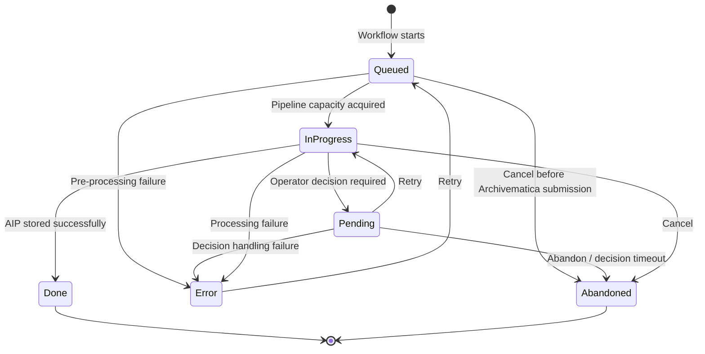

# User Manual

## Getting started

### The Enduro dashboard

This is the Enduro Collections dashboard, the default landing page for the
application. The dashboard lists individual transfers that were part of batch
ingests and shows their processing status.

- `QUEUED`: The transfer has been included in a batch import and is awaiting
  ingest into Archivematica.
- `IN PROGRESS`: The transfer has been ingested into Archivematica and is being
  processed.
- `DONE`: The transfer has been processed in Archivematica and the resulting
  AIP has been placed in archival storage.
- `ERROR`: The transfer was ingested into Archivematica but an error prevented
  it from being packaged into an AIP and/or placed in archival storage.

### Watching filesystem and object stores

It is possible to configure watchers that monitor filesystems or object stores
in order to start the processing of transfers automatically. See the [watcher
configuration section](./configuration-reference.md#watcher) for more details.

### Preparing transfers for batch import

- Enduro is designed to import and queue up multiple transfers for ingest into
  Archivematica. In order to prepare your holdings for import, you will need to
  place your transfers in a location that your administrator has set up for this
  purpose.
- Once your transfers are in place, you will be telling Enduro where to look for
  them to start the import process. You will be directing Enduro to look in a
  given parent directory, and when it does it will import all of the top-level
  subdirectories in that parent directory.
- For example, if you create a top-level directory called *EnduroTests*, and
  place subdirectories called *Nature*, *Household items* and *Buildings*
  inside it, Enduro will consider each of those subdirectories to be transfers
  (regardless of the directory structure within those subdirectories).

### Starting a batch import

- To start a new batch ingest, click on Batch import in the upper right corner
  of the Collections tab. This will open a new batch import page.
- Enter the path of the directory containing the transfers to be ingested.
- Enter the name of the Archivematica processing pipeline that will be used to
  perform the ingest.
- Click Submit. Note that the page does not change when Submit is clicked;
  don't re-click.

- Return to the Collections page. You will see a set of new transfers, likely
  with a status of QUEUED or IN PROGRESS.
- As each transfer is processed into an AIP and placed in archival storage, its
  status will change to DONE. Congratulations! You have just used Enduro to
  perform batch processing.
- NOTE: Enduro will automatically use the "automated" processing configuration
  file in the selected Archivematica pipeline for each transfer.
- NOTE: If you have your Archivematica dashboard open you will see the
  transfers appearing in the Archivematica transfer tab and then in the ingest
  tab. Once the transfers have finished processing and the AIP has been placed
  in archival storage, however, the transfers will no longer be visible in the
  transfer and ingest tabs. Enduro has cleared them out of those tabs in order
  to ensure that the tabs don't get cluttered. However, if an error has
  occurred and the Enduro Collections tab shows a status of ERROR, the failed
  transfer remains visible in the transfer and/or ingest tabs (depending on
  which micro-service failed).

## Collection status state machine

Enduro collection statuses describe Enduro's view of the processing workflow.
The normal lifecycle is `queued` -> `in progress` -> `done`. Operator actions
and failures can move the collection into `pending`, `error`, or `abandoned`.
The actions below describe normal dashboard behavior; lower-level API endpoints
may accept a broader set of calls.

| Status | Meaning | Operator actions in the dashboard |
| --- | --- | --- |
| `queued` | Enduro has created the collection workflow, but the transfer has not started processing yet. It may be waiting for pipeline capacity. | Cancel is available when no Archivematica `transfer_id` has been assigned yet. Delete is not shown while the collection is still running. |
| `in progress` | Enduro has acquired pipeline capacity and processing is underway. At this point the transfer may have been submitted to Archivematica. | Cancel is available. This stops Enduro's workflow, but it does not guarantee that already-submitted Archivematica work is stopped. Delete is not shown while the collection is still running. |
| `pending` | Processing needs an operator decision before it can continue, usually after an activity failed and Enduro is waiting for retry or abandon. | Retry and Abandon are available from the pending decision controls. Delete is not shown while the collection is waiting for a decision. |
| `done` | Processing completed successfully and the AIP was stored. | Delete is available. |
| `error` | Processing failed and the workflow ended without a successful or operator-abandoned outcome. | Retry and Delete are available. Bulk Retry also targets collections in this state. |
| `abandoned` | Processing was stopped by an operator decision or cancellation. | Delete is available. |
| `new` | Reserved by the API but not used by the current processing workflow. | No normal dashboard action. |
| `unknown` | Used when Enduro cannot map a status value to one of the known states. | Delete is available because the dashboard does not treat this as a running state. |

The main transitions are:

| From | To | Cause |
| --- | --- | --- |
| `queued` | `in progress` | Enduro acquires a pipeline capacity slot and starts the processing session. |
| `queued` | `abandoned` | An operator cancels the collection before an Archivematica transfer ID is assigned. |
| `queued` | `error` | The workflow fails before pipeline capacity is acquired, for example while checking duplicates, parsing metadata, loading configuration, or creating the processing session. |
| `in progress` | `pending` | A workflow activity requires an operator decision before continuing. |
| `pending` | `in progress` | An operator chooses Retry. |
| `pending` | `abandoned` | An operator chooses Abandon, or the pending decision times out. |
| `pending` | `error` | The decision path fails or receives an invalid decision value. |
| `in progress` | `done` | Processing, ingest, and storage complete successfully. |
| `in progress` | `error` | Processing fails without a successful or abandoned outcome. |
| `in progress` | `abandoned` | An operator cancels the Enduro workflow. |
| `error` | `queued` | An operator retries the collection, starting a new workflow run. |

Cancel and Delete are different operations. Cancel asks Enduro to stop the
processing workflow when possible. For queued collections that do not have an
Archivematica transfer ID yet, canceling prevents submission to Archivematica.
Delete removes the Enduro collection record and does not cancel processing that
has already been started elsewhere.

## Pipeline capacity

Pipeline capacity is the main operator-facing control for concurrent ingest
work. Each configured pipeline has its own `capacity`, and each active
workflow that is currently using that pipeline consumes one unit until Enduro
releases it.

In practice, throughput is shaped by more than one setting:

- `pipeline.capacity` limits concurrent work per Archivematica pipeline
- `worker.maxConcurrentSessionExecutionSize` limits concurrent workflow
  sessions across the whole Enduro worker
- `worker.maxConcurrentWorkflowsExecutionsSize` limits how many workflows the
  worker accepts from Temporal overall

Effective throughput is therefore the lowest limit that applies at that moment.
If worker-level limits are lower than the sum of all pipeline capacities, those
worker settings become the actual bottleneck. If a single pipeline has a low
capacity, that pipeline will queue new work even when other pipelines are idle.

Recovery also matters here. In the current implementation, post-ingest
reconciliation retries still occupy a pipeline slot until Storage Service
confirms the outcome or the retry window expires. On busy systems, that can
temporarily reduce effective throughput for recovery-enabled pipelines. See the
[Recovery Guide](./user-manual-recovery.md) for the current limitations and
operator impact.

When queue growth or unexpectedly low throughput shows up in production, check:

- whether `pipeline.capacity` reflects the actual safe ingest concurrency for
  each Archivematica pipeline
- whether worker-level concurrency caps are lower than the intended total
  pipeline throughput
- whether recovery-enabled pipelines are spending time waiting on
  post-ingest reconciliation

## Configuration

Enduro is configured via the `enduro.toml` configuration file, which uses
TOML.

The default search paths are `/etc/enduro.toml`, `$HOME/.config/enduro.toml`,
and the current directory. Additionally, users can indicate the configuration
file using the optional argument `--config=example.toml`.

The full configuration schema now lives in the
[Configuration Reference](./configuration-reference.md). Use that page for the
complete list of attributes, examples, and section-by-section reference
material.

Common entry points:

- [API server configuration](./configuration-reference.md#api)
- [Watcher configuration](./configuration-reference.md#watcher)
- [Pipeline configuration](./configuration-reference.md#pipeline)
- [Worker configuration](./configuration-reference.md#worker)
- [Workflow configuration](./configuration-reference.md#workflow)
- [Recovery Guide](./user-manual-recovery.md)
- [Example `enduro.toml`](https://github.com/artefactual-labs/enduro/blob/main/enduro.toml)
